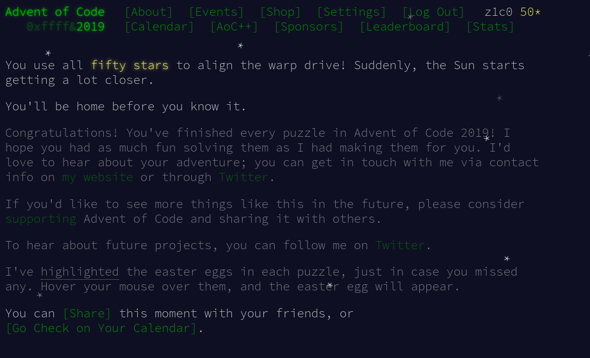
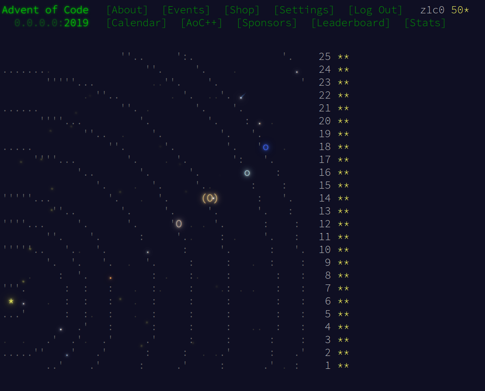

# Advent of Code 2019

https://adventofcode.com/2019

## Day 18

I almost gave up on this one but finally succeeded as my last-but-one (see Day22)
puzzle. For some reason, I really had a hard time wrapping my head around this puzzle.
The trick was using a `PriorityQueue` and clever caching (dynamic programming) as
so often with this kind of way-finding-challenges.

## Day 22

There was absolutely no way I could have solved the second part of that puzzle.
despite of wasting many hours on the problem. I went to the forums and more or
less copied a working version. This was a big bummer since it was the final
and 300th star missing for me. "Achieving" it that way just felt dirty and
not the least bit satisfying.
